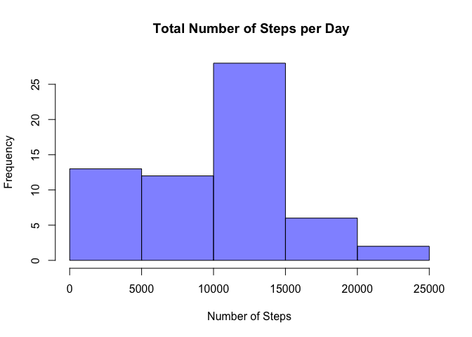
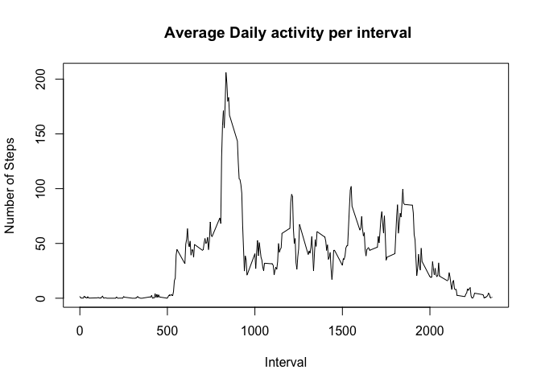
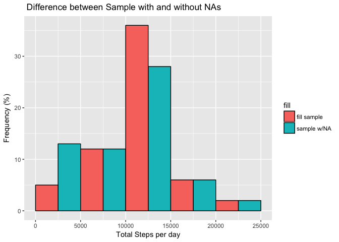
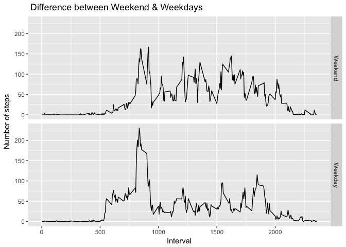

# Reproducible Research: Peer Assessment 1


## 1. Loading and preprocessing the data
##### 1.1  Load the data
##### 1.2  Process/transform the data into a format suitable for your analysis

```r
library(lubridate)
library(ggplot2)
library(dplyr)
```


```r
if(!file.exists('activity.csv')){
      temp_1 <- tempfile()
      download.file("https://d396qusza40orc.cloudfront.net/repdata%2Fdata%2Factivity.zip", temp_1)
      unzip('activity.zip')
      unlink(temp)
}
data_activity <- read.csv('activity.csv', header = TRUE)
data_activity$date <- ymd(data_activity$date)
```

## 2. What is mean total number of steps taken per day?

##### For this part of the assignment, you can ignore the missing values in the dataset.

##### 2.1 Calculate the total number of steps taken per day


```r
sum_steps <- tapply(data_activity$steps,
            data_activity$date, FUN = sum, na.rm=TRUE)
sum_steps
```

```
## 2012-10-01 2012-10-02 2012-10-03 2012-10-04 2012-10-05 2012-10-06 
##          0        126      11352      12116      13294      15420 
## 2012-10-07 2012-10-08 2012-10-09 2012-10-10 2012-10-11 2012-10-12 
##      11015          0      12811       9900      10304      17382 
## 2012-10-13 2012-10-14 2012-10-15 2012-10-16 2012-10-17 2012-10-18 
##      12426      15098      10139      15084      13452      10056 
## 2012-10-19 2012-10-20 2012-10-21 2012-10-22 2012-10-23 2012-10-24 
##      11829      10395       8821      13460       8918       8355 
## 2012-10-25 2012-10-26 2012-10-27 2012-10-28 2012-10-29 2012-10-30 
##       2492       6778      10119      11458       5018       9819 
## 2012-10-31 2012-11-01 2012-11-02 2012-11-03 2012-11-04 2012-11-05 
##      15414          0      10600      10571          0      10439 
## 2012-11-06 2012-11-07 2012-11-08 2012-11-09 2012-11-10 2012-11-11 
##       8334      12883       3219          0          0      12608 
## 2012-11-12 2012-11-13 2012-11-14 2012-11-15 2012-11-16 2012-11-17 
##      10765       7336          0         41       5441      14339 
## 2012-11-18 2012-11-19 2012-11-20 2012-11-21 2012-11-22 2012-11-23 
##      15110       8841       4472      12787      20427      21194 
## 2012-11-24 2012-11-25 2012-11-26 2012-11-27 2012-11-28 2012-11-29 
##      14478      11834      11162      13646      10183       7047 
## 2012-11-30 
##          0
```


##### 2.2 Make a histogram of the total number of steps taken each day


```r
hist(sum_steps, 
     main = " Total Number of Steps per Day", 
     xlab = "Number of Steps",
     col = rgb(0,0,1,2/4)
     )
```

<!-- -->


##### 2.3 Calculate and report the mean and median of the total number of steps taken per day.


```r
median_steps <- median(sum_steps)
mean_steps <- mean(sum_steps)
median_steps
```

```
## [1] 10395
```

```r
mean_steps
```

```
## [1] 9354.23
```

Hence, the mean steps per day is 9354.2295082 while the median is 10395.

## 3 What is the average daily activity pattern?


##### 3.1 Make a time series plot of the 5-minute interval(x-axis) and the average number of steps taken, averaged across all days(y-axis)


```r
daily_steps <- data_activity %>%
      group_by(interval) %>%
      summarise(steps = mean(steps, na.rm = TRUE))
plot(daily_steps, type = "l", xlab = "Interval", ylab = "Number of Steps",
     main = " Average Daily activity per interval")
```

<!-- -->

##### 3.2 Which 5-minute interval, on average across all the days in the dataset, contains the maximum number of steps?


```r
max_mean_steps <- tapply(daily_steps$steps, daily_steps$interval, sum)
which.max(max_mean_steps)
```

```
## 835 
## 104
```

```r
max_mean_steps[104]
```

```
##      835 
## 206.1698
```
The interval that contains the maximum number of step with ~206 steps per day, is the interval 835 (index 104).


## 4 Imputing missing values


##### 4.1 Calculate and report the total number of missing values in the dataset (i.e. the total number of rows with Nas)


```r
missing_values <- sum(is.na(data_activity))
missing_values_percent <- (sum(is.na(data_activity))/nrow(data_activity))*100
```

The total number of NAs is 2304, this represent 13.1147541 %


##### 4.2 Devise a strategy for filling in all of the missing values in the dataset. The strategy does not need to be sophisticated. For example, you could use the mean/median for that day, or the mean for that 5-minute interval, etc.
##### 4.3 Create a new dataset that is equal to the original dataset but with the missing data filled in.


I have generated a new data_frame ("full_activity") and use the mean of each inverval to fill the NAs values


```r
full_activity <- data_activity
non_values <- is.na(full_activity$steps)
mean_interval <- tapply(data_activity$steps, data_activity$interval,
                        mean, na.rm = TRUE)
full_activity$steps[non_values] <- mean_interval[as.character(full_activity$interval[non_values])]
sum_full <- tapply(full_activity$steps, full_activity$date,sum)
new_steps <- rbind(data.frame(fill = "fill sample", obs = sum_full),
                   data.frame(fill = "sample w/NA", obs = sum_steps))
```


##### 4.4 Make a histogram of the total number of steps taken each day and Calculate and report the mean and median total number of steps taken per day. Do these values differ from the estimates from the first part of the assignment? What is the impact of imputing missing data on the estimates of the total daily number of steps?


```r
ggplot(new_steps, aes(x = obs, fill = fill)) +
      geom_histogram(breaks = seq(0,25000, by = 5000), colour="black", position="dodge") +
      labs(title = " Difference between Sample with and without NAs")+
      labs(x = "Total Steps per day", y = "Frequency (%)")
```

<!-- -->


```r
median_steps_full <- median(sum_full)
mean_steps_full <- mean(sum_full)
dif_median <- median_steps_full - median_steps
dif_mean <-  mean_steps_full - mean_steps
dif_median
```

```
## [1] 371.1887
```

```r
dif_mean
```

```
## [1] 1411.959
```
Thus, the values differ from the first part of the assignment. The median and the mean have both increased in 371.1886792and 1411.959171 respectively.

## 5. Are there differences in activity patterns between Weekdays and Weekends?
##### Use the dataset with the filled-in missing values for this part.

##### 5.1 Create a new factor variable in the dataset with two levels "weekday"" and "weekend"" indicating whether a given date is a weekday or weekend day.


```r
Weekend <- c("Saturday", "Sunday")
full_activity$wdays <- factor((weekdays(full_activity$date) %in% Weekend), 
                   levels=c(TRUE, FALSE), labels=c("Weekend", "Weekday") )
interval_full <- full_activity %>%
      group_by(interval, wdays) %>%
      summarise(steps = mean(steps))
```


##### 5.2 Make a panel plot containing a time series plot (i.e.type = "l" )of the 5-minute interval (x-axis) and the average number of steps taken, averaged across all weekday days or weekend days (y-axis). 


```r
s <- ggplot(interval_full, aes(x=interval, y=steps)) 
s + geom_line() +
      facet_grid(wdays ~.)+
      labs(title = " Difference between Weekend & Weekdays")+
      labs(x = "Interval", y = "Number of steps")
```

<!-- -->
